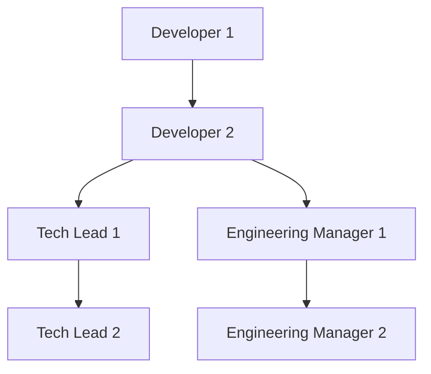

<script src="https://cdnjs.cloudflare.com/ajax/libs/Chart.js/2.9.4/Chart.bundle.min.js" integrity="sha512-SuxO9djzjML6b9w9/I07IWnLnQhgyYVSpHZx0JV97kGBfTIsUYlWflyuW4ypnvhBrslz1yJ3R+S14fdCWmSmSA==" crossorigin="anonymous"></script>
<script>
window.addEventListener("load", function(){
  for (let element of document.getElementsByClassName("chartjs")) {
    let parent = element.parentNode
    let pparent = parent.parentNode
    let canvas = document.createElement('canvas');
    let box = document.createElement('div');
    box.appendChild(canvas);
    let ctx = canvas.getContext("2d")
    let myChart = new Chart(ctx, JSON.parse(element.textContent));
    box.setAttribute("style","display:block;width:75%;text-align:'center';margin: 5px auto;");
    pparent.replaceChild(box, parent)
  }
});
</script>

# エンジニアリングラダー

ispecのエンジニアのキャリアパスを表すモデル

キャリアレベルは以下のような遷移をする



# 評価項目

## Technology
技術への知見やスキルセット

| Level | Technology                                                                 |
|-------|----------------------------------------------------------------------------|
| 1     | 選定された技術をキャッチアップして自ら使えるようになる                     |
| 2     | 1 つ以上の技術領域に詳しく、その領域について率先してキャッチアップをできる |
| 3     | 新しい技術を調査・実証し、チームに導入できる                               |
| 4     | システムの技術スタック全体について深い知識を持っている                     |
| 5     | 社の技術全体について深い知識を持っている                                   |

## System
システムへのオーナーシップレベル

| Level | System                                                                       |
|-------|------------------------------------------------------------------------------|
| 1     | 既存の設計の上で新機能やバグ修正を行える                                     |
| 2     | システムの技術的負債を削減しながら、中規模から大規模の機能を設計・実装できる |
| 3     | システムが正常に運用されることに対して責任を持つことができる                 |
| 4     | 中長期的な要件見据えたとくてアーキテクチャの改善ができる                     |
| 5     | システムの技術的な優位性をリードし、システムの正常な稼働を維持できる         |

## People
チームとチームメンバーとの関係性

| Level | People                                                                                                         |
|-------|----------------------------------------------------------------------------------------------------------------|
| 1     | チームのサポートを受けながら、学び改善できる                                                                   |
| 2     | 他のチームメンバーを積極的にサポートできる                                                                     |
| 3     | 他のチームメンバーを指導しキャリアアップに貢献できる                                                           |
| 4     | メンバー個人だけでなく、チーム全体に対して効果的なフィードバックを提供できる                                   |
| 5     | チームメンバーのキャリア、要望、パフォーマンス、エンゲージメントに対してポジティブな影響を与えることができる。 |

## Process
開発プロセスへの関与度合い

| Level | Process                                                                  |
|-------|--------------------------------------------------------------------------|
| 1     | チームプロセスに従って開発を進められる                                   |
| 2     | チームのプロセスへの深い理解を持っている                                 |
| 3     | チームのプロセスの課題を発見し、改善できる                               |
| 4     | フィードバックからプロセス自体のを改善ができる                           |
| 5     | チームの成熟度に適したプロセスを定義し、俊敏性と規律のバランスをとれる。 |

## Influence
影響範囲

| Level | Influence                                      |
|-------|------------------------------------------------|
| 1     | 関わった機能とそれに関係する人に影響力を持てる |
| 2     | チーム全体に影響を与えられる                   |
| 3     | 複数のチームに絵今日を与えられる               |
| 4     | 技術組織全体に影響を与えられる                 |
| 5     | 会社全体に影響を与えられる                     |

# キャリアレベル
## Developer
エンジニアとして実際にコーディングを行うロール。
技術への深い理解が求められる。

### Developer 1 (D1)

|           | Level |
|-----------|-------|
| Tech      | 1     |
| System    | 1     |
| People    | 1     |
| Process   | 1     |
| Influence | 1     |

```chartjs
{
  "type": "radar",
  "data": {
    "labels": [
      "Tech",
      "System",
      "People",
      "Process",
      "Influence"
    ],
    "datasets": [
      {
        "label": "Bar Dataset",
        "data": [
          10,
          20,
          30,
          40
        ],
        "borderColor": "rgb(255, 99, 132)",
        "backgroundColor": "rgba(255, 99, 132, 0.2)"
      },
      {
        "label": "Line Dataset",
        "data": [
          50,
          50,
          50,
          50
        ],
        "type": "line",
        "fill": false,
        "borderColor": "rgb(54, 162, 235)"
      }
    ]
  },
  "options": {
    "scales": {
      "yAxes": [
        {
          "ticks": {
            "beginAtZero": true
          }
        }
      ]
    }
  }
}
```


### Developer 2 (D2)

|           | Level |
|-----------|-------|
| Tech      | 2     |
| System    | 2     |
| People    | 2     |
| Process   | 3     |
| Influence | 2     |

## Tech Lead
システムのオーナーであり、アーキテクチャの決定や技術選定を行うロール。

### Tech Lead 1 (TL1)

|           | Level |
|-----------|-------|
| Tech      | 3     |
| System    | 4     |
| People    | 4     |
| Process   | 5     |
| Influence | 2     |

### Tech Lead 2 (TL2)

|           | Level |
|-----------|-------|
| Tech      | 4     |
| System    | 5     |
| People    | 4     |
| Process   | 5     |
| Influence | 4     |

## Engineering Manager
チームのマネージャーであり、採用やエンジニアの個人のアサインを行うロール。

### Engineering Manager 1

|           | Level |
|-----------|-------|
| Tech      | 3     |
| System    | 3     |
| People    | 5     |
| Process   | 3     |
| Influence | 2     |

### Engineering Manager 2

|           | Level |
|-----------|-------|
| Tech      | 3     |
| System    | 4     |
| People    | 5     |
| Process   | 4     |
| Influence | 2     |
